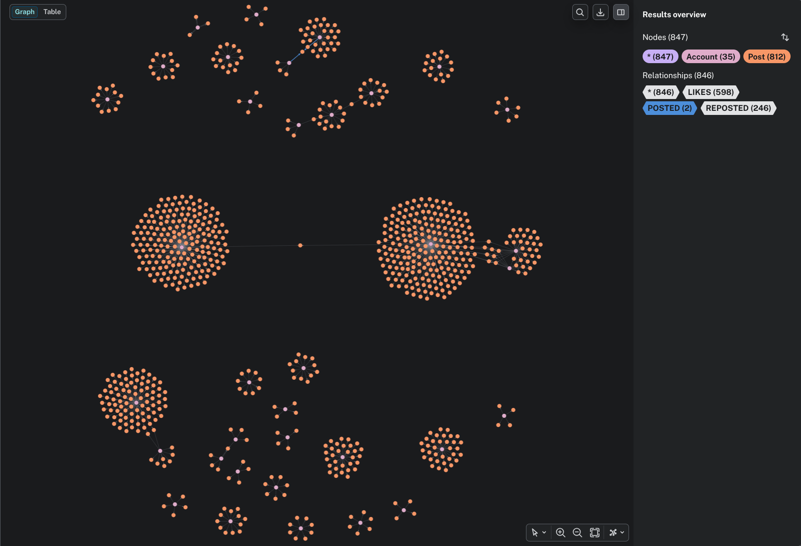

# guercio 

**guercio** [/'gwɛrtʃo/] **adj.** (It.) squint-eyed, cross-eyed, or one-eyed.

A bot detector that only sees out of one eye. This is a silly, for-fun project that ingests Jetstream firehoses and tries to find bots using graph algorithms. It might be squinting, but it still manages to spot a few silly bots.

---

### Setup
1. **Configure:** Copy `.env.example` to `.env` and enter your Neo4j credentials.
2. **Database:** Start the environment with `docker-compose up -d`.
3. **Run:** Execute the detector via `go run ./cmd/main.go`.
4. **Visualise**: You can access the Neo4j UI via http://localhost:7474/
